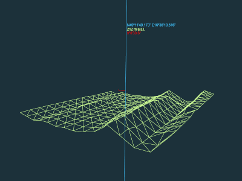

# Elevation Locator

A little experiment with threejs, geolocation and elevation data from elevationapi.

## Give it a try!* **

🚀 https://marianpekar.github.io/elevation-locator/

*) There is a limit for API requests per API key per minute, if page sudennly stuck, the limit may be reached. 
Just wait a few seconds or visit https://elevation-api.io/ to get your own key, then clone this repository, replace the value of `const KEY` at the first line of `elevation-locator.js` and run `index.html` in your favorite browser locally. 

**) The red line always points to the north and its lenght is same as the length of one square which you can see on red label in DMS format. There are 196 (14^2) squares total.

## Controls

### Mouse

Move around in scene with

- Scroll up/down ➜ zoom in/out
- LMB + Move ➜ rotate
- RMB + Move ➜ traverse

### Keyboard (control terrain)

Change geolocation, rotation, and zoom

- [ W ] ➜ Move north
- [ S ] ➜ Move south
- [ A ] ➜ Move west
- [ D ] ➜ Move east
- [ R ] ➜ Turn rotation on/off
- [ + ] ➜ Zoom in*
- [ - ] ➜ Zoom out

*) Decrease step size = plane covers a smaller area (in square degrees) in bigger detail. Zoom out works the other way around, of course.

### On-screen Buttons

Comes handy on touch screens.

